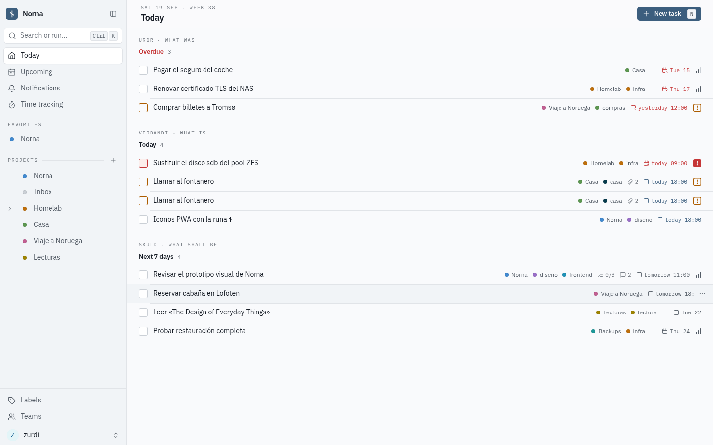
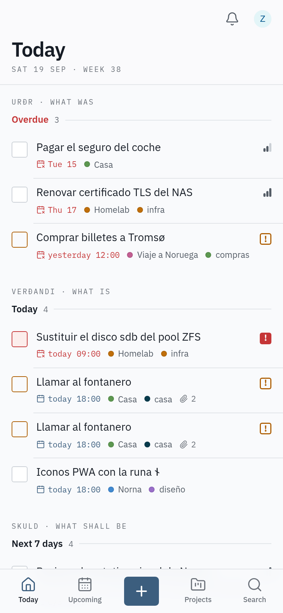
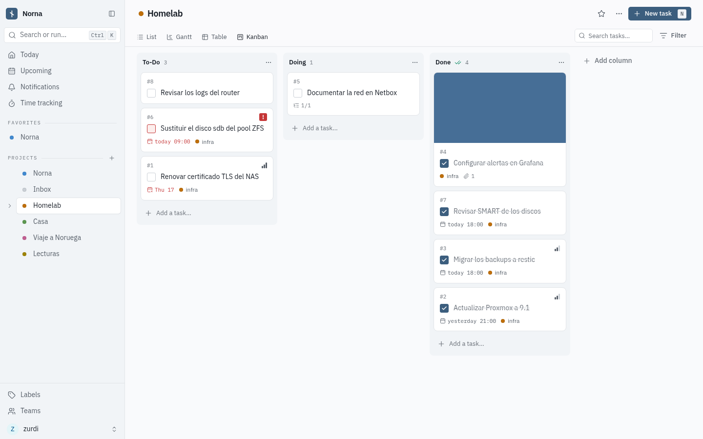
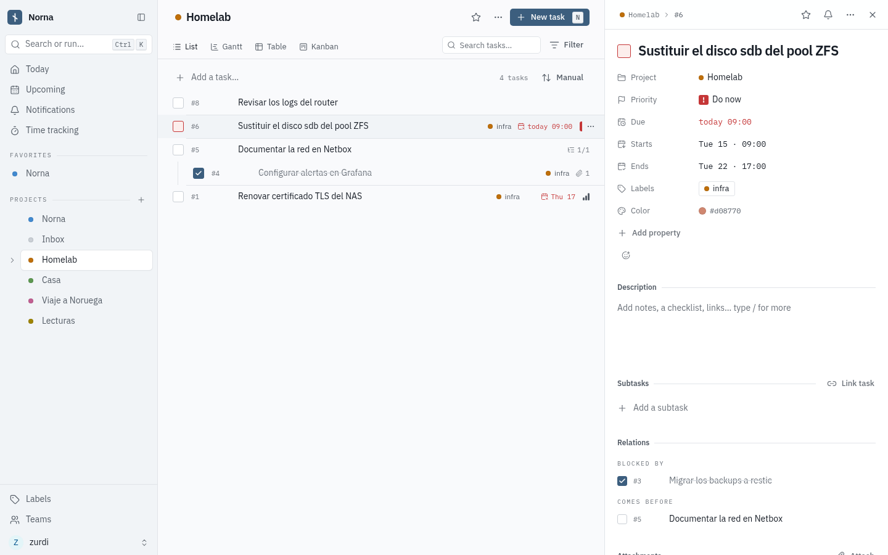
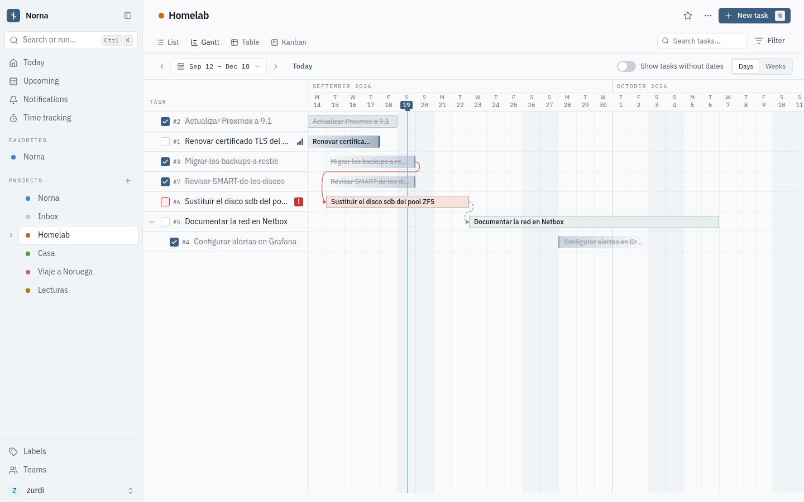
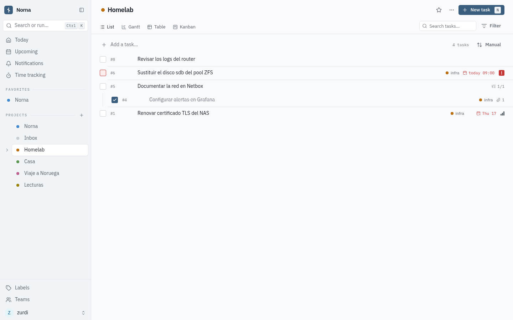
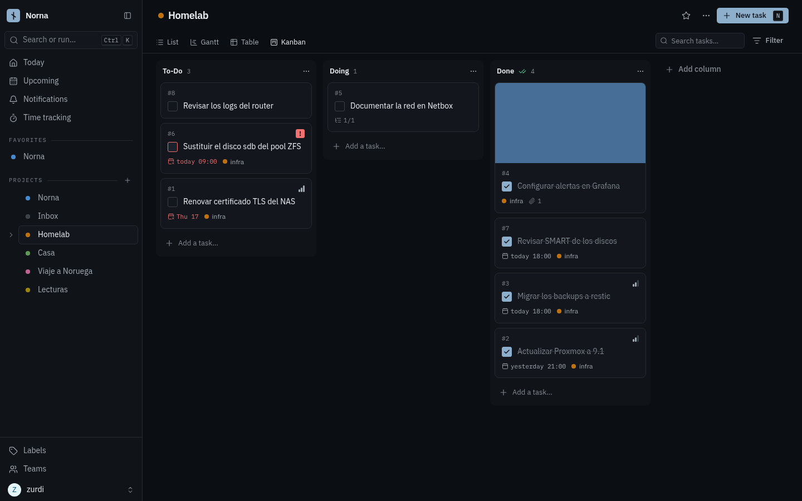
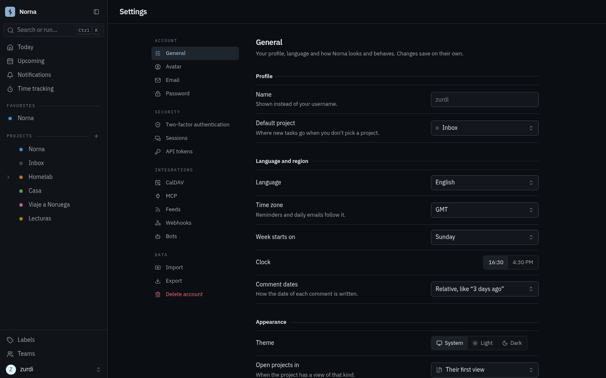
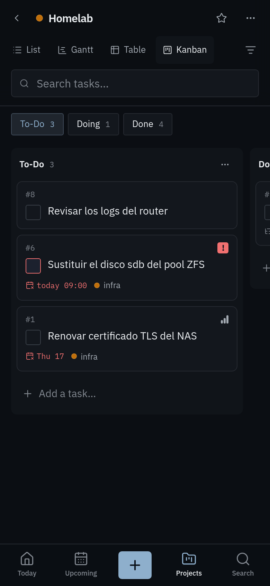

<p align="center">
  <picture>
    <source media="(prefers-color-scheme: dark)" srcset="docs/assets/logo-dark.svg">
    
  </picture>
</p>

<h1 align="center">Norna</h1>

<p align="center">
  Tasks and projects, woven together.
</p>

<p align="center">
  <a href="https://github.com/zurdi15/norna/actions/workflows/ci.yml"></a>
  <a href="https://github.com/zurdi15/norna/releases"></a>
  <a href="LICENSE"></a>
</p>

Norna is a **self-hosted, multi-user** app for tasks and projects, built phone first. Plan your day in a list, move work across a board, see it on a timeline and keep everything on your own server. It ships as a single Docker image (a Go API with SQLite by default, and a Vue PWA). The name comes from the Norns, who weave what was, what is and what shall be — the three blocks of the Today screen.

## Features

- **Today and Upcoming** — overdue, today and the next seven days at a glance, or any range you pick.
- **Quick add with magic** — `Call the plumber tomorrow at 18 *home +House !3` sets the date, labels, project and priority as you type, highlighted in place. Dates are understood in English and Spanish, and one line per task adds several at once.
- **Four views per project** — list (with subtasks and manual order), table (pick and sort columns), kanban (columns with limits, a done column, drag between columns or "Move to…" on a phone) and gantt (drag or arrow-key bars, relation arrows).
- **Tasks with everything** — rich text descriptions with checklists, due/start/end dates, reminders, repeats, priorities, labels, assignees, relations and subtasks, attachments with previews, comments and reactions, and a colour.
- **Filters** — a query language with autocomplete (`done = false && dueDate < now+7d`) on any view, and saved filters that behave like projects.
- **Keyboard first on desktop** — a command palette (<kbd>Ctrl</kbd>/<kbd>⌘</kbd> <kbd>K</kbd>), `j`/`k` to move, `x` to select many and act on them together, and a shortcut for every common action.
- **Phone first on mobile** — a bottom bar, swipe to complete, long press for a task's menu, pickers as bottom sheets, one kanban column per screen.
- **Sharing** — with people, teams and public links (with an optional password), each read-only, read & write or admin.
- **Integrations** — CalDAV sync, an Atom feed, webhooks, API tokens with fine-grained permissions, bot accounts and an MCP endpoint for AI assistants.
- **Time tracking** — a timer per task, manual entries and totals by day and project.
- **Import and export** — from Todoist, Trello, Microsoft To Do, TickTick, WeKan, Planka, a CSV or another Norna; export your whole account as a zip.
- **Admin panel** — users, projects and invite links for the instance admins.
- **Accounts** — local accounts with optional two-factor authentication, LDAP or OpenID Connect; sessions you can sign out one by one.
- **ES/EN**, **light and dark** (following the system), and a **PWA** you can install.

## Screenshots

| Desktop | Mobile |
| :---: | :---: |
|  |  |

| Kanban | Task detail |
| :---: | :---: |
|  |  |

<details>
  <summary>More screenshots</summary>

| Gantt | List |
| :---: | :---: |
|  |  |

| Dark kanban | Settings |
| :---: | :---: |
|  |  |

| Kanban on a phone |
| :---: |
|  |

</details>

## Quick start

```yaml
services:
  norna:
    image: ghcr.io/zurdi15/norna:latest
    ports: ["3456:3456"]
    volumes: ["./data:/data"]
    environment:
      - NORNA_SERVICE_PUBLICURL=http://localhost:3456/
      - NORNA_SERVICE_SECRET=change-me-to-a-long-random-string
    restart: unless-stopped
```

```
mkdir -p data && sudo chown 1000:1000 data
docker compose up -d
```

Open `http://localhost:3456` and register the first account. To make it an instance admin (for the admin panel), run `docker compose exec norna /app/norna/norna user set-admin <username> --admin`. The commented compose file is [examples/docker-compose.yml](examples/docker-compose.yml).

## Configuration

Every setting is an environment variable with the `NORNA_` prefix, built from its path in the config file: `service.publicurl` is `NORNA_SERVICE_PUBLICURL`. A `config.yml` in `/app/norna/` works too; [config.yml.sample](config.yml.sample) lists every option with its default.

| Variable | Default | Description |
|---|---|---|
| `NORNA_SERVICE_PUBLICURL` | — | The URL people use to reach Norna. Links in emails, CalDAV and share links are built from it |
| `NORNA_SERVICE_SECRET` | random at each start | Signs sessions and tokens. **Set it**, or everyone is signed out on every restart |
| `NORNA_SERVICE_ENABLEREGISTRATION` | `true` | Let people create their own accounts. Turn it off once yours exists and use invite links |
| `NORNA_SERVICE_TIMEZONE` | `GMT` | The server's time zone, for reminders and overdue emails |
| `NORNA_DATABASE_TYPE` | `sqlite` | `sqlite`, `postgres` or `mysql` |
| `NORNA_DATABASE_PATH` | `/data/norna.db` | The SQLite file (in the image) |
| `NORNA_DATABASE_HOST` / `_USER` / `_PASSWORD` / `_DATABASE` | `localhost` / `norna` / — / `norna` | Postgres or MySQL connection |
| `NORNA_FILES_BASEPATH` | `/data/files` | Attachments, backgrounds and avatars (in the image) |
| `NORNA_FILES_MAXSIZE` | `20MB` | Largest upload |
| `NORNA_MAILER_ENABLED` | `false` | Send emails (reminders, invitations, password resets) |
| `NORNA_MAILER_HOST` / `_PORT` / `_USERNAME` / `_PASSWORD` / `_FROMEMAIL` | — / `587` / — / — / — | SMTP server |
| `NORNA_AUTH_OPENID_ENABLED` | `false` | Sign in through OpenID Connect providers (configured in `config.yml`) |

### Data

Everything worth keeping lives in `/data`: the SQLite database (`norna.db`) and the uploaded files (`files/`). Back up that directory; stop the container first so the database file is consistent:

```bash
docker compose stop && tar czf norna-backup.tar.gz -C ./data . && docker compose start
```

Settings → Export also gives each person a zip of their whole account, which another Norna can import.

### Reverse proxy

Point the proxy at port `3456` and set `NORNA_SERVICE_PUBLICURL` to the public address. Live updates (notifications, timers) use a WebSocket at `/api/v1/ws`, so the proxy must pass `Upgrade` headers. Serve it over HTTPS if you want to install the PWA on your phone.

### CalDAV

Calendar and task apps (Thunderbird, DAVx⁵, Apple Reminders…) can sync through CalDAV at `https://your-norna/dav/principals/<username>/`. Create a CalDAV token in **Settings → CalDAV** and use it as the password.

### MCP

AI assistants that speak the Model Context Protocol can work with your tasks through the MCP endpoint shown in **Settings → MCP**, with a token created there. The page walks you through connecting the usual clients.

## Development

Requirements: [mise](https://mise.jdx.dev/) (installs the Go, Node and pnpm versions from `mise.toml`).

```bash
mise install
go tool mage build                     # the API binary: ./norna
./norna                                # API on :3456 (config from config.yml or NORNA_* variables)
cd frontend && pnpm install
DEV_PROXY=http://127.0.0.1:3456 pnpm dev   # frontend on :4173 with hot reload
```

```
pkg/        Go API · Echo (v1) and Huma (v2) · XORM · SQLite, Postgres or MySQL
frontend/   Vue 3 · Vite · TypeScript · Tailwind 4 · Reka UI · TanStack Query (PWA)
Dockerfile  packages the static binary from `go tool mage build:static` into a scratch image
```

Tests: `go tool mage test:feature` and `go tool mage test:web` (API) · `cd frontend && pnpm vitest run --dir ./src` (unit) · `go tool mage test:e2e ""` (Playwright, desktop and phone). Lint: `go tool mage lint:fix` · `cd frontend && pnpm lint:fix`.

## License

AGPL-3.0 — see [LICENSE](LICENSE). Norna is a modified fork of Vikunja.
